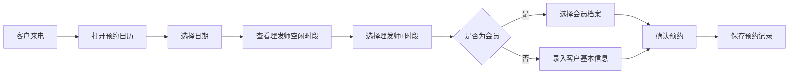
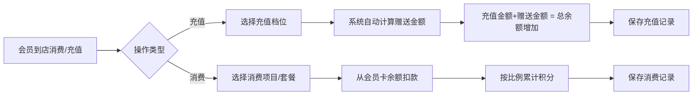
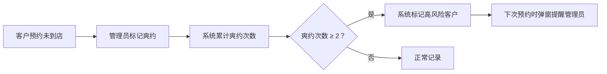

## 1. 产品概述

面向小型理发店的客户预约与会员积分管理系统，帮助店主高效管理两位理发师的预约排班、会员卡充值消费、积分兑换，以及月度经营数据统计。

- 核心目标：解决预约冲突、简化会员管理、自动积分提醒、数据可视化
- 目标用户：理发店店主/前台管理人员

## 2. 核心功能

### 2.1 用户角色

| 角色 | 注册方式 | 核心权限 |
|------|----------|----------|
| 管理员 | 默认账号登录 | 全部功能：预约管理、会员管理、积分规则、数据统计 |

### 2.2 功能模块

1. **预约管理**：日历视图、理发师排班、时段查询、爽约记录
2. **会员管理**：会员档案、会员卡充值、余额查询、消费记录
3. **积分管理**：积分规则设置、积分兑换、过期提醒
4. **数据统计**：理发师业绩、套餐销量、月度报表
5. **系统设置**：充值规则配置、积分规则配置、基础信息维护

### 2.3 页面详情

| 页面名称 | 模块名称 | 功能描述 |
|----------|----------|----------|
| 首页仪表盘 | 今日概览 | 显示今日预约数、待提醒积分、本月收入趋势 |
| 首页仪表盘 | 快捷操作 | 快速新建预约、会员充值入口 |
| 预约管理 | 日历视图 | 按周/日显示预约，颜色区分理发师 |
| 预约管理 | 新建预约 | 选择日期→选择理发师→选择空闲时段→录入客户信息 |
| 预约管理 | 预约详情 | 查看/编辑/取消预约，标记爽约状态 |
| 会员管理 | 会员列表 | 搜索、筛选、分页显示所有会员 |
| 会员管理 | 会员详情 | 查看基本信息、余额、积分、消费记录 |
| 会员管理 | 充值/消费 | 会员卡充值（赠送规则自动生效）、消费扣款并累计积分 |
| 积分管理 | 积分规则 | 设置消费积分比例、兑换项目（洗吹/礼品等）、清零周期 |
| 积分管理 | 积分兑换 | 记录积分兑换历史，扣减对应积分 |
| 积分管理 | 过期提醒 | 列表显示30天内即将过期的积分客户 |
| 数据统计 | 理发师排名 | 按月统计各理发师服务客户数量、营业额 |
| 数据统计 | 套餐销量 | 烫染套餐销量排行榜，图表展示 |
| 系统设置 | 充值规则 | 自定义充X送Y规则，支持多档配置 |
| 系统设置 | 理发师管理 | 维护两位理发师的基本信息、工作时间 |

## 3. 核心流程

### 3.1 预约流程

客户来电预约 → 管理员打开日历视图 → 选择目标日期 → 查看两位理发师各时段空闲情况 → 选择空闲时段 → 录入（或选择已有）客户信息 → 确认预约 → 系统保存并在日历上标记占用

### 3.2 会员充值消费流程

### 3.3 爽约提醒流程

## 4. 用户界面设计

### 4.1 设计风格

- **主色调**：深胡桃木色 `#3E2723`（沉稳理发店质感）搭配暖金色 `#D4AF37`（会员尊贵感）
- **辅助色**：象牙白 `#FFF8E7` 背景、摩卡棕 `#8D6E63` 次级按钮
- **按钮风格**：圆角胶囊形按钮，主按钮金色描边+深色填充，hover有微上浮阴影
- **字体**：标题使用「思源宋体」（优雅质感），正文使用「思源黑体」（清晰易读）
- **布局风格**：左侧导航栏 + 右侧卡片式内容区，顶部显示当前页面和快捷搜索
- **图标风格**：线性简约图标，统一金色线条风格，搭配emoji增强可读性

### 4.2 页面设计概述

| 页面名称 | 模块名称 | UI元素 |
|----------|----------|----------|
| 首页仪表盘 | 今日概览 | 4个数据卡片（今日预约、在店客户、待提醒积分、本月营业额），金色数据大字+深色标签 |
| 首页仪表盘 | 本周预约 | 迷你时间轴列表，理发师颜色标签区分 |
| 预约管理 | 日历视图 | 周视图为主，时间轴9:00-21:00，两位理发师两列并排，色块标记预约状态（已确认/爽约/已完成） |
| 预约管理 | 新建预约弹窗 | 分步式表单，步骤指示器，日期选择器+时间块网格选择 |
| 会员管理 | 会员列表 | 搜索框+会员卡状态筛选，卡片式展示会员头像+等级标签+余额积分概览 |
| 会员管理 | 充值弹窗 | 档位按钮（充200送30/充500送100等），实时显示到账金额 |
| 数据统计 | 图表区域 | 柱状图展示理发师业绩，饼图展示套餐销量占比，暖色系配色 |
| 积分过期提醒 | 提醒列表 | 红色感叹号图标标记高危客户，按过期天数倒序排列，一键发送提醒按钮 |

### 4.3 响应式设计

- 采用桌面端优先设计，最小宽度支持 1280px
- 核心日历视图和数据表格不做移动端压缩，专为桌面管理场景优化
- 弹窗和表单在小屏（≥1024px）自动适配居中，保留完整操作区域
