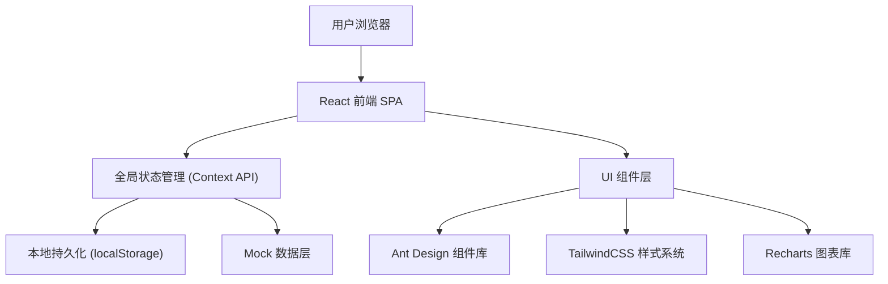
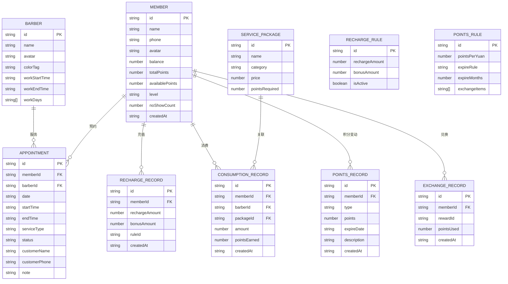

## 1. 架构设计



## 2. 技术选型说明

- **前端框架**: React@18 + TypeScript（类型安全，提升可维护性）
- **构建工具**: Vite（启动快、热更新流畅）
- **UI组件库**: Ant Design@5（成熟的企业级组件，日历、表单、表格开箱即用）
- **样式方案**: TailwindCSS@3（原子化CSS，快速构建自定义样式）
- **图表库**: Recharts（React原生图表，柱状图/饼图/折线图齐全）
- **状态管理**: React Context API + useReducer（轻量级，避免Redux复杂度）
- **数据持久化**: localStorage（无后端场景，数据本地保存）
- **路由**: React Router DOM@6（单页应用路由管理）
- **图标**: Ant Design Icons + Lucide React（双重图标库，按需选择）

## 3. 路由定义

| 路由路径 | 页面名称 | 说明 |
|----------|----------|------|
| `/` | 首页仪表盘 | 今日数据概览、快捷操作入口 |
| `/appointments` | 预约管理 | 日历视图、预约列表、新建/编辑预约 |
| `/members` | 会员管理 | 会员列表、会员详情、充值/消费操作 |
| `/points` | 积分管理 | 积分规则、兑换记录、过期提醒 |
| `/statistics` | 数据统计 | 理发师业绩、套餐销量、月度报表 |
| `/settings` | 系统设置 | 充值规则、理发师信息、积分规则配置 |

## 4. 数据模型定义

### 4.1 实体关系图 (ER Diagram)



### 4.2 初始化数据 (Mock Data)

**理发师数据**:
```typescript
const barbers = [
  {
    id: 'b1',
    name: '阿明师傅',
    avatar: '💈',
    colorTag: '#D4AF37',
    workStartTime: '09:00',
    workEndTime: '21:00',
    workDays: ['1', '2', '3', '4', '5', '6']
  },
  {
    id: 'b2',
    name: '小红老师',
    avatar: '✂️',
    colorTag: '#8D6E63',
    workStartTime: '10:00',
    workEndTime: '20:00',
    workDays: ['1', '2', '3', '4', '5', '6', '0']
  }
];
```

**充值规则**:
```typescript
const rechargeRules = [
  { id: 'r1', rechargeAmount: 200, bonusAmount: 30, isActive: true },
  { id: 'r2', rechargeAmount: 500, bonusAmount: 100, isActive: true },
  { id: 'r3', rechargeAmount: 1000, bonusAmount: 280, isActive: true }
];
```

**服务套餐**:
```typescript
const servicePackages = [
  { id: 's1', name: '精剪造型', category: '剪发', price: 68, pointsRequired: 0 },
  { id: 's2', name: '健康洗吹', category: '洗护', price: 38, pointsRequired: 500 },
  { id: 's3', name: '陶瓷烫', category: '烫发', price: 398, pointsRequired: 0 },
  { id: 's4', name: '韩式染发', category: '染发', price: 298, pointsRequired: 0 },
  { id: 's5', name: '烫染套餐', category: '烫染', price: 598, pointsRequired: 0 },
  { id: 's6', name: '护理SPA', category: '护理', price: 168, pointsRequired: 0 }
];
```

## 5. 项目目录结构

```
src/
├── assets/                 # 静态资源
│   └── styles/             # 全局样式
├── components/             # 通用组件
│   ├── Layout/             # 布局组件（侧边栏+顶部导航）
│   ├── Card/               # 数据卡片
│   └── Modal/              # 通用弹窗
├── pages/                  # 页面组件
│   ├── Dashboard/          # 首页仪表盘
│   ├── Appointments/       # 预约管理
│   ├── Members/            # 会员管理
│   ├── Points/             # 积分管理
│   ├── Statistics/         # 数据统计
│   └── Settings/           # 系统设置
├── context/                # 全局状态
│   ├── AppContext.tsx      # 应用级Context
│   ├── MemberContext.tsx   # 会员状态
│   └── AppointmentContext.tsx # 预约状态
├── types/                  # TypeScript类型定义
│   └── index.ts
├── utils/                  # 工具函数
│   ├── storage.ts          # localStorage封装
│   ├── date.ts             # 日期处理
│   └── mockData.ts         # Mock数据生成
├── hooks/                  # 自定义Hooks
│   └── useLocalStorage.ts
├── App.tsx                 # 根组件
├── main.tsx                # 入口文件
└── router.tsx              # 路由配置
```
